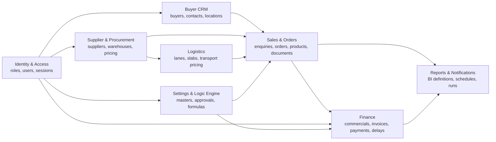
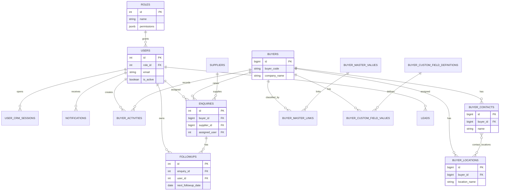
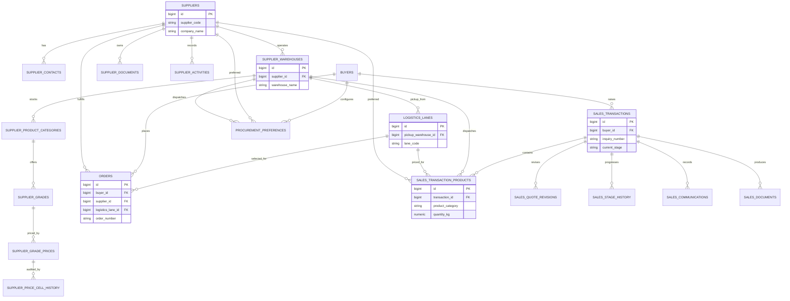
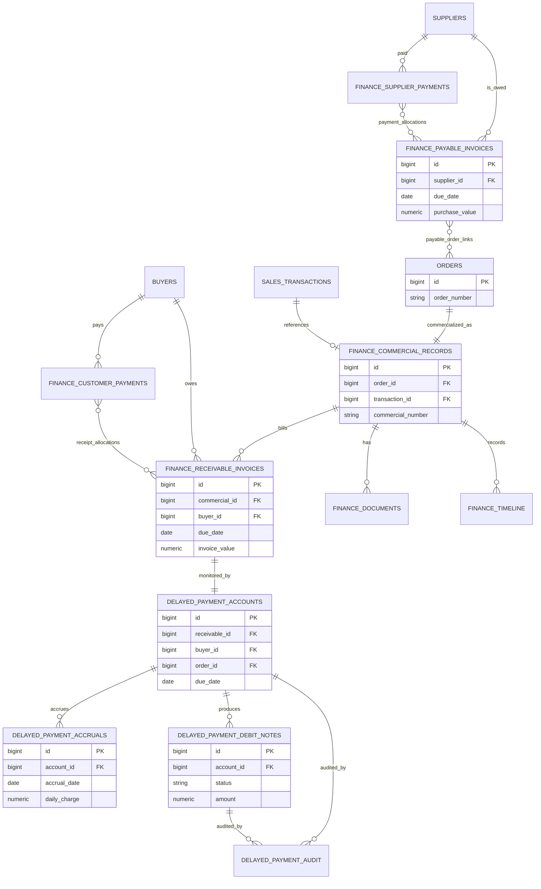
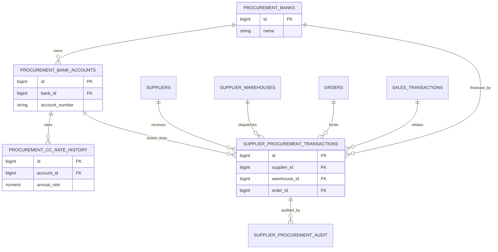
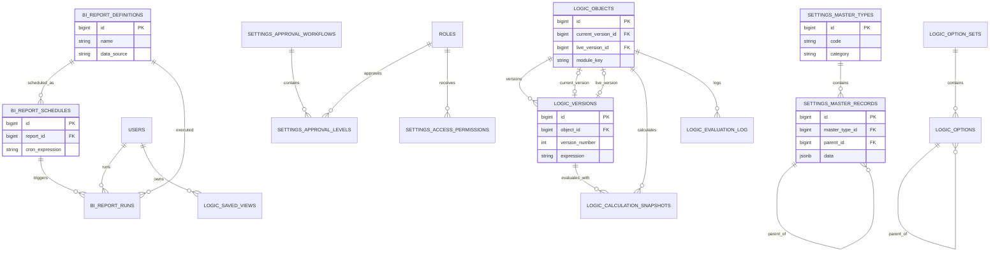

# Cresco CRM Database ERD

The database is split into related business domains. The diagrams emphasize primary business relationships rather than every audit/configuration column. SQL files in `db-init.sql`, `db-modules.sql`, and `database-scripts/` remain the authoritative schema.

## Domain map

## Identity and CRM core

## Suppliers, logistics and orders

## Finance and delayed payments

## Procurement working capital

## Reporting, settings and business logic

## Schema ownership notes

- Foreign keys commonly use `ON DELETE CASCADE` for owned child data and `SET NULL`/`RESTRICT` for auditable business records.
- `users` and `roles` are shared across nearly every domain for ownership, approval, and audit metadata.
- JSONB is deliberately used for configurable permissions, master data, rule definitions, templates, and calculation inputs/results.
- Join tables implement many-to-many allocation and classification relationships.
- Migration order matters: core identity and master entities must exist before orders, finance, reporting, and logic-engine migrations.
