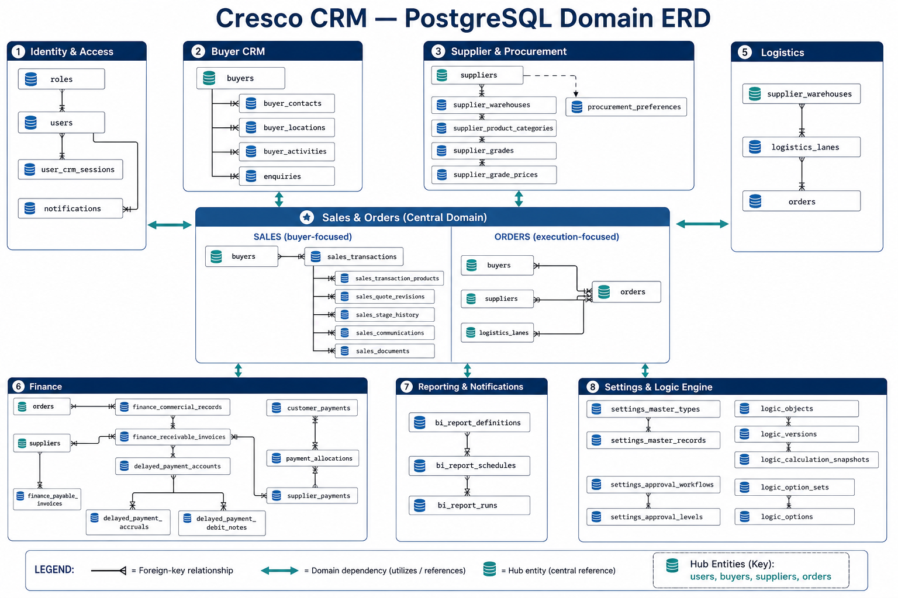

# Cresco CRM Architecture

This folder documents the production architecture and the PostgreSQL data model.

- [System architecture](./SYSTEM-ARCHITECTURE.md)
- [Database ERD](./DATABASE-ERD.md)
- [System architecture image](./cresco-crm-system-architecture.png)
- [Database ERD image](./cresco-crm-database-erd.png)

## Image previews

The diagrams use Mermaid and render directly in GitHub, GitLab, and Mermaid-compatible Markdown viewers.

These documents reflect the current `docker-compose.yml`, Express routes, and SQL migration files. Update them whenever deployment topology or major database relationships change.
