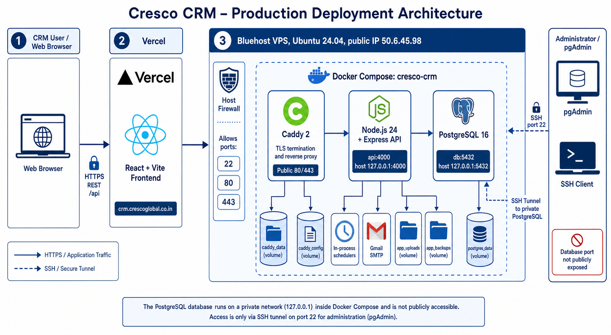
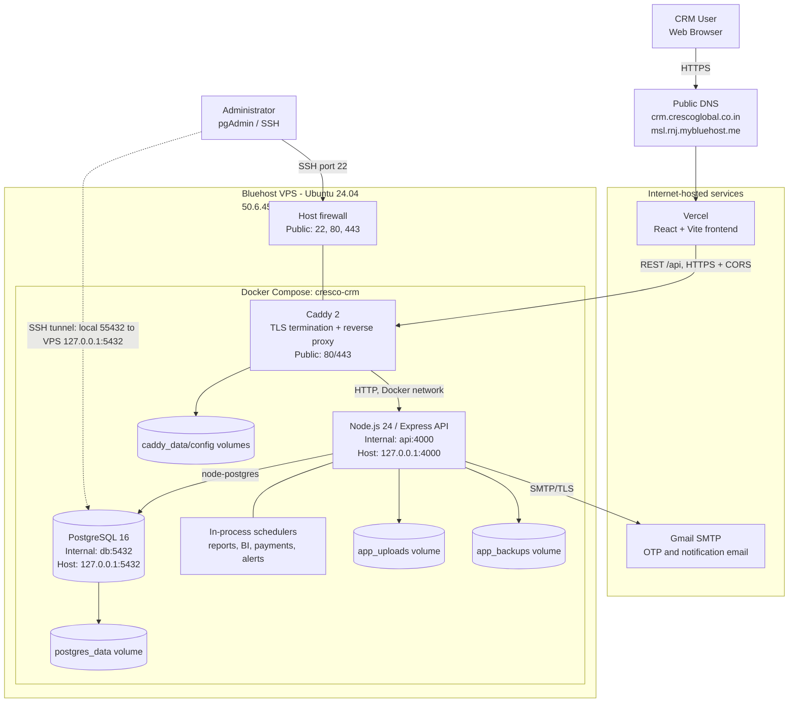
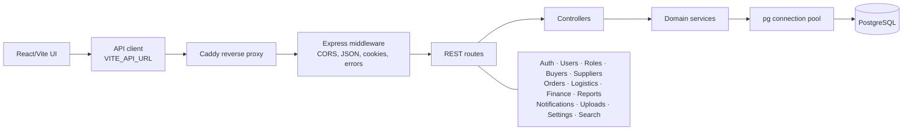
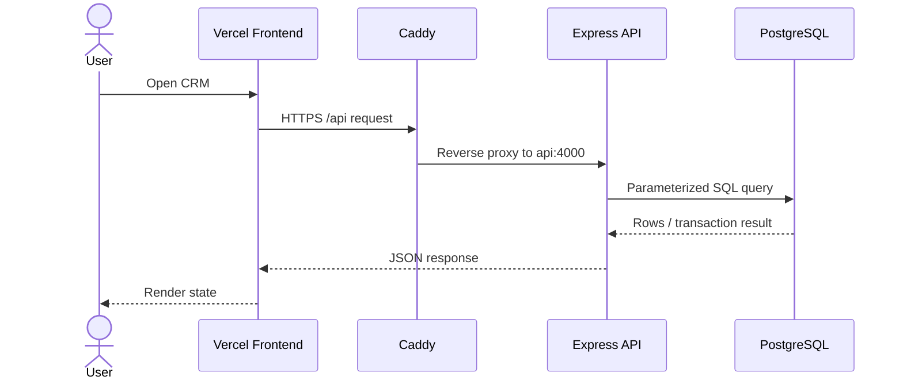
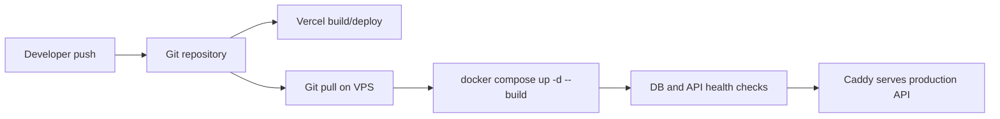

# Cresco CRM System Architecture

## Production topology

## Application layers

## Network and configuration

| Component | Address | Exposure |
|---|---|---|
| Frontend | `https://crm.crescoglobal.co.in` | Public via Vercel |
| API | `https://msl.rnj.mybluehost.me/api` | Public via Caddy |
| Caddy | VPS ports `80`, `443` | Public |
| Node API | Docker `api:4000`, host `127.0.0.1:4000` | Private |
| PostgreSQL | Docker `db:5432`, host `127.0.0.1:5432` | Private |
| SSH | VPS port `22` | Restricted administrative access |

Runtime secrets live only in server-owned `.env.production`. The frontend receives only `VITE_API_URL`. PostgreSQL access from a workstation uses pgAdmin's SSH tunnel (VPS host `50.6.45.98`, destination `127.0.0.1:5432`) rather than exposing port 5432 publicly.

## Request and deployment flow

## Persistence and operations

- `postgres_data` is the live database volume; a Docker volume is not a backup.
- `app_uploads` stores uploaded application files.
- `app_backups` stores application-generated backup artifacts.
- `caddy_data` retains TLS certificates; `caddy_config` retains Caddy state.
- API and database containers use health checks and `unless-stopped` restart policies.
- Scheduled jobs execute inside the API process, so only one production API scheduler instance should run unless jobs are given distributed locking.
- Database backups should be exported off-host and restore-tested regularly.
